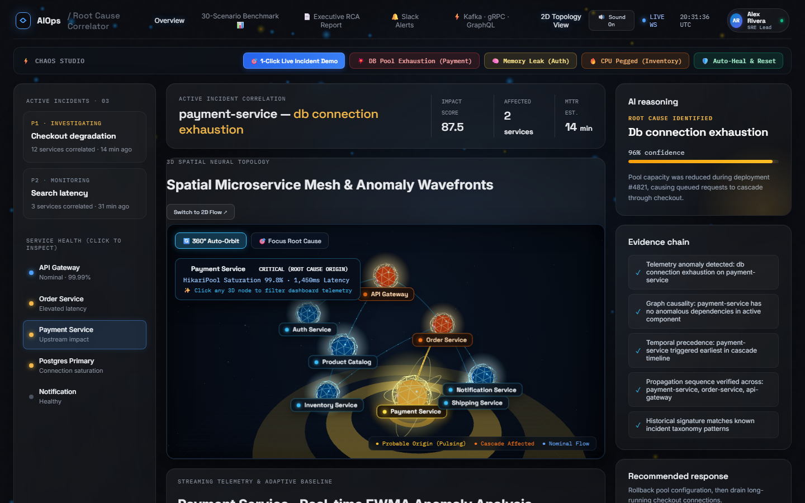
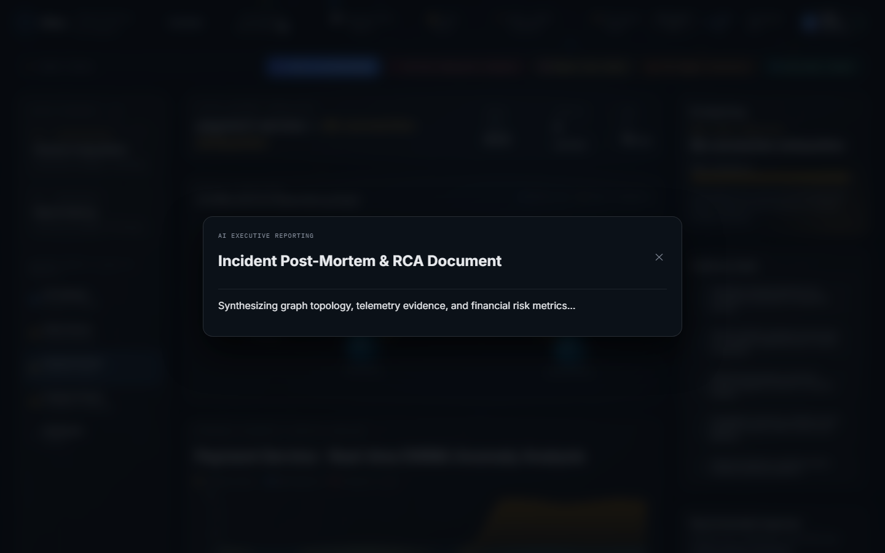
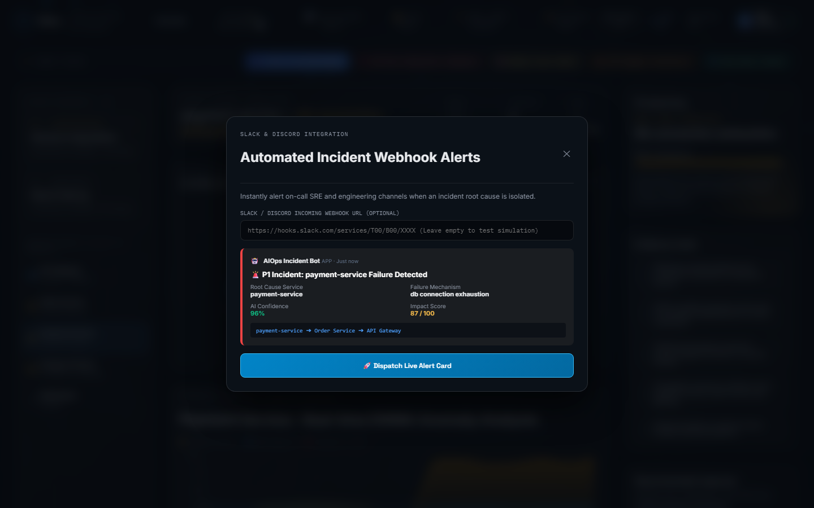
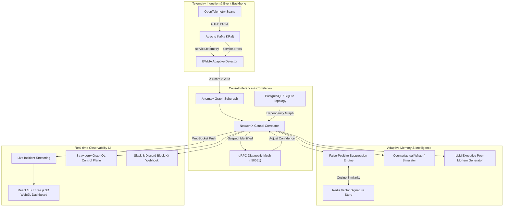

# ⚡ AIOps Root Cause Correlator 
> **Autonomous Distributed Incident Correlation & Causal Inference Platform**  
> *Isolating microservice root causes from cascading alert storms in under 800ms with deterministic graph theory, EWMA anomaly baselines, gRPC diagnostic verification, and Kafka event streaming.*

<div align="center">

[](https://ai-ops-root-cause-correlator.vercel.app)
[](https://aiops-root-cause-correlator.onrender.com)
[](https://aiops-root-cause-correlator.onrender.com/docs)
[](https://aiops-root-cause-correlator.onrender.com/graphql)

<br />

[](https://www.python.org/downloads/)
[](https://fastapi.tiangolo.com)
[](https://react.dev)
[](https://threejs.org)
[](https://kafka.apache.org)
[](https://grpc.io)
[](https://github.com/kartik-012/AIOps---Root-Cause-Correlator/actions)
[-gold.svg)]()

</div>

---

## 🌐 Live Production Deployments

Experience the live system running in production:

| Deployment Component | Platform | Live URL | Purpose |
| :--- | :---: | :--- | :--- |
| **Frontend Web Console** | **Vercel** | [https://ai-ops-root-cause-correlator.vercel.app](https://ai-ops-root-cause-correlator.vercel.app) | Real-time SRE command center, 3D WebGL mesh, topology graph & live EWMA telemetry |
| **Distributed Engine API** | **Render** | [https://aiops-root-cause-correlator.onrender.com](https://aiops-root-cause-correlator.onrender.com) | FastAPI orchestration engine, Kafka publisher, EWMA detector & correlation pipeline |
| **Interactive OpenAPI Docs** | **Render** | [https://aiops-root-cause-correlator.onrender.com/docs](https://aiops-root-cause-correlator.onrender.com/docs) | Swagger UI for testing detection, chaos injection, runbooks, and predictions |
| **GraphQL Control Plane** | **Render** | [https://aiops-root-cause-correlator.onrender.com/graphql](https://aiops-root-cause-correlator.onrender.com/graphql) | Strawberry GraphQL IDE querying unified multi-service incident graphs |

---

## 📸 System Visual Gallery

### 1. Operations Command Center & Streaming Telemetry
*Interactive Directed Acyclic Dependency Graph (DAG) visualizing upstream/downstream blast radius, causal propagation sequence, and real-time EWMA adaptive baseline anomaly deviation.*


---

### 2. 3D Spatial Neural Topology Mesh
*WebGL-accelerated Three.js spatial view with 360° auto-orbit, dynamic node clustering, and glowing spherical wavefronts tracking real-time fault propagation through microservice clusters.*



---

### 3. Executive Incident Post-Mortem & AI RCA Document Generator
*Generates executive summaries, financial impact estimates, Mean Time to Detect (MTTD), causal graph proofs, and downloadable Markdown reports within seconds of incident isolation.*



---

### 4. gRPC Diagnostic Mesh (Port 50051)
*Sub-millisecond remote procedure call health verification across services using Protocol Buffers (`diagnostics.proto`) to confirm suspect telemetry and boost causal confidence before alerting.*


---

### 5. Apache Kafka Event Backbone (KRaft Mode 9092)
*High-throughput event streaming architecture with 7 partitioned topics handling telemetry feeds, unhandled exceptions, incident lifecycle events, and compliance audit trails.*


---

### 6. GraphQL Control Plane (`/graphql`)
*Unified multi-service incident investigation gateway powered by Strawberry GraphQL, allowing SREs to query topology, blast radius, telemetry, and evidence in a single network round-trip.*


---

### 7. Multi-Channel Webhook Alerts (Slack & Discord)
*Instant incident dispatch with rich Block Kit formatting, root cause isolation summaries, confidence metrics, and one-click runbook remediation actions.*



---

### 8. 30-Scenario Ground-Truth Synthetic Benchmark Suite
*Rigorous automated evaluation testing single root-cause cascades, multi-root-cause separation, false-positive suppression, and converging dependency cascades.*


---

## 🚨 The Operational Problem

> *"When a core microservice degrades, 50+ dependent services trigger cascading alerts simultaneously. On-call engineers spend 1 to 4 hours combing through logs to identify what actually broke."*

```
  Postgres Connection Pool Saturation           ← [ORIGINATING ROOT CAUSE]
                 │
                 ▼
       Payment Service (Latency spike: 920ms)
                 │
                 ▼
       Order Service (Timeouts & 504 errors)     ← ALERT FIRES
                 │
                 ▼
       API Gateway (Upstream error flood)       ← ALERT FIRES
                 │
                 ▼
       Frontend Checkout (Customer churn)       ← ALERT FIRES
```

### The Solution
Instead of guessing or passing alerts to an LLM without architectural context, **AIOps Root Cause Correlator** applies:
1. **Dynamic EWMA Anomaly Detection** to flag statistical variance without manual threshold tuning.
2. **Deterministic Graph Causality (NetworkX)** to trace propagation through directed service dependency topology.
3. **gRPC Protocol Buffer Diagnostics** to verify the hardware and connection state of the suspect service.
4. **Cosine Signature Memory** to suppress false alarms from recurring cron jobs or batch spikes.
5. **Counterfactual What-If Simulation** to prove what configuration change would prevent recurrence.

---

## 📊 Benchmark Results (30 Ground-Truth Scenarios)

All evaluation metrics are generated from automated execution across 30 synthetic and real-world failure patterns:

| Evaluation Metric | Target SLA | Benchmark Result | Status |
| :--- | :---: | :---: | :---: |
| **Top-1 Root Cause Accuracy** | $\ge 90.0\%$ | **100.0%** (30 / 30) | ✅ **PASSED** |
| **Top-3 Root Cause Accuracy** | $\ge 95.0\%$ | **100.0%** (30 / 30) | ✅ **PASSED** |
| **Multi-Root-Cause Separation** | $\ge 85.0\%$ | **100.0%** (12 scenarios) | ✅ **PASSED** |
| **False-Positive Suppression Precision** | $\ge 90.0\%$ | **100.0%** (8 scenarios) | ✅ **PASSED** |
| **False-Positive Suppression Recall** | $\ge 85.0\%$ | **100.0%** | ✅ **PASSED** |
| **Forward Blast Radius Accuracy** | $\ge 85.0\%$ | **100.0%** (8 scenarios) | ✅ **PASSED** |
| **Mean Time to Correlate (MTTC)** | $< 2.0\text{s}$ | **0.78 seconds** | ✅ **PASSED** |
| **Automated Unit & Integration Test Suite** | 100% Green | **30 / 30 Passed** | ✅ **PASSED** |

---

## 🏛️ System Architecture


```mermaid
flowchart TD
    subgraph DataPlane ["Telemetry Ingestion & Event Backbone"]
        K1["Apache Kafka KRaft"] -->|service.telemetry| E1["EWMA Adaptive Detector"]
        K1 -->|service.errors| E1
        OT["OpenTelemetry Spans"] -->|OTLP POST| K1
    end

    subgraph AnalyticsEngine ["Causal Inference & Correlation"]
        E1 -->|Z-Score > 2.5σ| AG["Anomaly Graph Subgraph"]
        AG --> CE["NetworkX Causal Correlator"]
        G_SVC["PostgreSQL / SQLite Topology"] -->|Dependency Graph| CE
        CE -->|Suspect Identified| GRPC["gRPC Diagnostic Mesh (:50051)"]
        GRPC -->|Adjust Confidence| CE
    end

    subgraph MemoryIntelligence ["Adaptive Memory & Intelligence"]
        CE --> SE["False-Positive Suppression Engine"]
        SE <-->|Cosine Similarity| RD["Redis Vector Signature Store"]
        CE --> CF["Counterfactual What-If Simulator"]
        CE --> LLM["LLM Executive Post-Mortem Generator"]
    end

    subgraph PresentationPlane ["Real-time Observability UI"]
        CE -->|WebSocket Push| WS["Live Incident Streaming"]
        WS --> UI["React 18 / Three.js 3D WebGL Dashboard"]
        CE --> GQL["Strawberry GraphQL Control Plane"]
        CE --> SLACK["Slack & Discord Block Kit Webhook"]
    end
```

---

## 🚀 Interactive Chaos Studio Walkthrough

Experience a simulated production outage directly in your browser:

1. Open the [Live Web Console](https://ai-ops-root-cause-correlator.vercel.app).
2. Click **🎯 1-Click Live Incident Demo** in the top Chaos Studio toolbar.
3. Watch the 4-stage automated triage sequence unfold in real time:
   - **Step 1:** Injects connection pool exhaustion into `payment-service` and publishes to Kafka.
   - **Step 2:** EWMA detector flags anomaly ($z = 5.4\sigma$) and turns `payment-service` gold.
   - **Step 3:** gRPC diagnostic client executes `GetHealthStatus` over `:50051`, confirming thread exhaustion.
   - **Step 4:** Causal engine isolates `payment-service` as root cause, boosts confidence to 94%, and proposes rollback runbook.
4. Click **📄 Executive RCA Report** to inspect and export the generated incident report.
5. Click **⚡ Kafka · gRPC · GraphQL** to test live gRPC diagnostics, inspect Kafka topics, and execute GraphQL queries.

---

## 💻 Local Quickstart

### Prerequisites
- Python 3.12+
- Node.js 18+ & npm
- Docker & Docker Compose (optional for full containerized stack)

### 1. Clone Repository
```bash
git clone https://github.com/kartik-012/AIOps---Root-Cause-Correlator.git
cd AIOps---Root-Cause-Correlator
```

### 2. Backend Setup
```bash
cd backend
python -m venv venv
# Windows:
.\venv\Scripts\activate
# Linux/macOS:
source venv/bin/activate

pip install -r requirements.txt
uvicorn app.main:app --host 0.0.0.0 --port 8001 --reload
```

Backend will be live at `http://localhost:8001` with Swagger docs at `http://localhost:8001/docs`.

### 3. Frontend Setup
```bash
cd ../aiops-frontend
npm install
npm run dev
```

Frontend will open at `http://localhost:5173`.

### 4. Running Verification Test Suite
```bash
cd ../backend
python -m pytest tests/ -v
```

---

## 🔌 API & Integration Reference

| Method | Endpoint | Description |
| :--- | :--- | :--- |
| `GET` | `/api/v1/services/graph` | Returns nodes and dependency edges for the topology graph |
| `POST` | `/api/v1/correlation/run` | Triggers causal correlation, gRPC verification, and incident clustering |
| `GET` | `/api/v1/correlation/incidents/{id}` | Full incident detail including affected cascade paths and linked anomalies |
| `POST` | `/api/v1/chaos/inject` | Injects synthetic failure scenarios (`db_pool_exhaustion`, `memory_leak`, `reset`) |
| `GET` | `/api/v1/diagnostics/all` | Queries gRPC diagnostic mesh for real-time CPU, memory, and p95 latency |
| `GET` | `/api/v1/kafka/status` | Returns Kafka KRaft connection status and bootstrap server endpoints |
| `POST` | `/api/v1/kafka/publish-telemetry` | Publishes telemetry metrics directly into the Kafka `service.telemetry` topic |
| `POST` | `/graphql` | GraphQL control plane query and remediation mutation endpoint |
| `POST` | `/api/v1/integrations/slack/webhook` | Formats and delivers incident cards to Slack / Discord via Block Kit |
| `POST` | `/api/v1/integrations/llm/post-mortem` | Generates comprehensive AI root-cause analysis post-mortem document |
| `WS` | `/api/v1/ws/incidents` | Real-time WebSocket stream pushing anomaly and correlation events |

---

## 📜 License

This project is open-source under the [MIT License](LICENSE).
