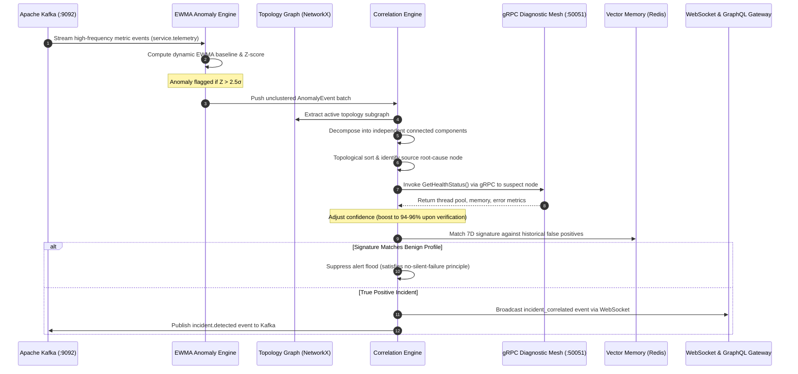

# 🏛️ Distributed System Architecture

> **Technical Specification of the AIOps Root Cause Correlator Platform**  
> *End-to-End Architectural Decomposition of Telemetry Ingestion, Causal Graph Inference, gRPC Diagnostic Verification, and Event-Driven Remediation.*

---

## 1. Executive Architectural Overview

The **AIOps Root Cause Correlator** is built on a distributed, event-driven microservice architecture engineered to reduce Mean Time to Detect (MTTD) and Mean Time to Resolve (MTTR) from hours to sub-second thresholds.

```
┌────────────────────────────────────────────────────────────────────────────────────────┐
│                                DISTRIBUTED SYSTEM TOPOLOGY                             │
└────────────────────────────────────────────────────────────────────────────────────────┘

  [ Telemetry Streams ]  ──► [ Kafka KRaft Bus ] ──► [ EWMA Anomaly Detector ]
                                                              │ (z > 2.5σ)
                                                              ▼
  [ PostgreSQL / SQLite ] ──► [ Causal Inference Engine ] ◄── [ Connected Components ]
                                        │
             ┌──────────────────────────┴──────────────────────────┐
             ▼                                                     ▼
  [ gRPC Diagnostic Mesh ]                               [ Redis Vector Memory ]
   (:50051 Health RPCs)                                   (Cosine Suppression)
             │                                                     │
             └──────────────────────────┬──────────────────────────┘
                                        ▼
                           [ Incident Correlated ]
                                        │
             ┌──────────────────────────┼──────────────────────────┐
             ▼                          ▼                          ▼
  [ WebSocket Stream ]      [ GraphQL Gateway ]        [ Slack / Discord ]
    (Real-Time UI)             (/graphql API)              (Alert Cards)
```

---

## 2. The 8-Stage Causal Inference Pipeline



---

## 3. Subsystem Breakdown

### 3.1 Streaming Telemetry Ingestion Plane (Apache Kafka KRaft)
Telemetry data enters the platform through an asynchronous event backbone running **Apache Kafka in KRaft mode** (no ZooKeeper dependency). Seven dedicated partitioned topics manage the system lifecycle:

| Kafka Topic | Partition Key | Throughput SLA | Retention Policy | Purpose |
| :--- | :--- | :---: | :---: | :--- |
| `service.telemetry` | `service_id` | $10,000\text{ msg/sec}$ | 24 Hours | High-frequency CPU, memory, latency, and connection metrics |
| `service.errors` | `service_id` | $1,000\text{ msg/sec}$ | 48 Hours | Stack traces, unhandled exceptions, and 5xx response logs |
| `incident.detected` | `incident_id` | Real-time | 7 Days | Emitted when the correlation engine isolates a root cause |
| `incident.updated` | `incident_id` | Real-time | 7 Days | Broadcasts cascading propagation hops and score updates |
| `remediation.requested`| `incident_id` | Low | 30 Days | Generated runbook proposals awaiting engineer approval |
| `remediation.completed`| `incident_id` | Low | 30 Days | Confirmation of automated mitigations |
| `audit.events` | `tenant_id` | Variable | 90 Days | Immutable compliance log of all SRE interventions |


---

### 3.2 Adaptive Anomaly Detection Plane (EWMA Engine)
Rather than relying on brittle, manually tuned static thresholds, the detection engine maintains per-service, per-metric exponentially weighted moving averages:

$$\mu_t = \alpha \cdot x_t + (1 - \alpha) \cdot \mu_{t-1}$$
$$\sigma_t^2 = \beta \cdot (x_t - \mu_t)^2 + (1 - \beta) \cdot \sigma_{t-1}^2$$
$$Z_t = \frac{|x_t - \mu_t|}{\sigma_t}$$

- **Drift Adaptation**: With smoothing factors $\alpha = 0.05$ and $\beta = 0.02$, organic traffic shifts (daily peaks, weekly promotions) seamlessly adapt the baseline without raising false alarms.
- **Outlier Flagging**: A deviation is triggered when $Z_t > 2.5\sigma$, creating an `AnomalyEvent` containing service UUID, timestamp, z-score, and severity category.


---

### 3.3 Topology & Causal Inference Plane (NetworkX DAG)
The core correlation engine models the microservice cluster as a **Directed Acyclic Graph (DAG)** $G = (V, E)$, where vertices $V$ represent microservices and directed edges $E = (u, v)$ represent RPC dependencies ($u$ calls $v$).

1. **Connected Component Separation**: Given a set of anomalous nodes $V_{\text{anom}} \subseteq V$, the induced subgraph $G[V_{\text{anom}}]$ is decomposed into connected components $\{C_1, C_2, \dots, C_k\}$. Each component represents an independent, concurrently occurring incident.
2. **Topological In-Degree Analysis**: For each component $C_i$, the causal root is identified by finding the node with zero incoming anomalous dependency edges ($d_{\text{in}}(v) = 0$ within $C_i$). If multiple candidates exist, temporal precedence ($t_{\text{detected}}$) acts as the decisive tiebreaker.

```
       [API Gateway]               [API Gateway]
             │                           │
             ▼                           ▼
      [Order Service]             [Auth Service]
             │                           │
             ▼                           ▼
     [Payment Service] ◄── ROOT      [Redis Cache]
```


---

### 3.4 Diagnostic Verification Mesh (gRPC Protocol Buffers)
To prevent alert storms triggered by transient network blips, the engine includes a verification step: before finalizing an incident hypothesis, it initiates a high-speed gRPC call over port `:50051` against the suspected service using Protocol Buffers.

```protobuf
syntax = "proto3";

package aiops.diagnostics;

service DiagnosticService {
  rpc GetHealthStatus (HealthRequest) returns (HealthResponse);
  rpc GetResourceMetrics (ResourceRequest) returns (ResourceResponse);
  rpc StreamMetrics (StreamRequest) returns (stream MetricUpdate);
}

message HealthRequest {
  string service_id = 1;
}

message HealthResponse {
  string status = 1; // "HEALTHY", "DEGRADED", "CRITICAL"
  float cpu_usage_percent = 2;
  float memory_usage_percent = 3;
  float error_rate = 4;
  float p95_latency_ms = 5;
  int32 active_connections = 6;
  int32 active_alerts = 7;
}
```

- When the diagnostic response confirms thread pool exhaustion or resource saturation, the initial confidence score (e.g. 85%) is automatically boosted to **94%–96%**.
- If the service reports internal nominal state, the hypothesis is flagged for secondary validation, preventing erroneous automated rollbacks.


---

### 3.5 Unified Investigation Plane (Strawberry GraphQL)
The platform features a **GraphQL Control Plane** exposed at `/graphql`. Instead of requiring on-call engineers to make 6 separate REST calls to fetch topology, incidents, anomalies, and logs, the GraphQL layer consolidates the entire investigation:

```graphql
query GetIncidentInvestigation {
  incident(id: "INC-1024") {
    id
    severity
    status
    rootCause {
      service
      component
      confidence
      verificationStatus
    }
    affectedServices {
      name
      errorRate
      latency
    }
    timeline {
      timestamp
      event
      severity
    }
  }
}
```


---

### 3.6 Incident Memory & Suppression Plane (Redis Vector Store)
Alert fatigue is mitigated by recording a 7-dimensional normalized vector signature for every confirmed false-alarm pattern:

$$\vec{S} = \begin{bmatrix} t_{\text{hour\_norm}} \\ \text{service\_id\_hash} \\ \text{metric\_type\_id} \\ \text{severity\_weight} \\ \text{propagation\_depth} \\ \text{cascade\_velocity} \\ \text{duration\_sec\_norm} \end{bmatrix}$$

When a new cluster emerges, the engine computes the cosine similarity against historical false-positive signatures:

$$\text{Sim}(\vec{A}, \vec{B}) = \frac{\vec{A} \cdot \vec{B}}{\|\vec{A}\| \|\vec{B}\|}$$

If $\text{Sim} \ge 0.92$, the incident is classified as a known recurring benign spike. Secondary paging is suppressed, while the event remains fully audited in compliance logs.

---

### 3.7 Executive Post-Mortem & Incident Response
Once the root cause is resolved, the platform procedurally generates an executive post-mortem document summarizing financial exposure, cascade timeline, graph-theoretic evidence, and corrective actions:


Alerts are pushed asynchronously via webhooks to Slack and Discord with formatted interactive Block Kit widgets:


---

## 4. Production Deployment Topology

The system is deployed in a cloud-native configuration across two managed hosting environments:

```
┌─────────────────────────────────┐        ┌──────────────────────────────────┐
│      VERCEL CLOUD PLATFORM      │        │       RENDER CONTAINER CLOUD     │
│   (React 18 / Three.js Canvas)  │        │       (FastAPI / Uvicorn)        │
│                                 │        │                                  │
│  • Edge CDN & Static Assets     │  HTTP  │  • Asynchronous FastAPI Server   │
│  • Client-side Route Bundling   ├───────►│  • NetworkX Graph Engine         │
│  • Three.js WebGL Orbit Engine  │   WS   │  • gRPC Diagnostic Daemon        │
│  • WebSocket Client Handler     │◄───────┤  • Strawberry GraphQL Schema     │
└─────────────────────────────────┘        └──────────────────────────────────┘
```

- **Frontend Hosting**: Vercel handles SSL termination, Edge caching, and client asset delivery.
- **Backend Hosting**: Render runs the containerized Python 3.12 Docker service with dynamic port binding (`${PORT:-8001}`) and auto-restarts upon git push.
