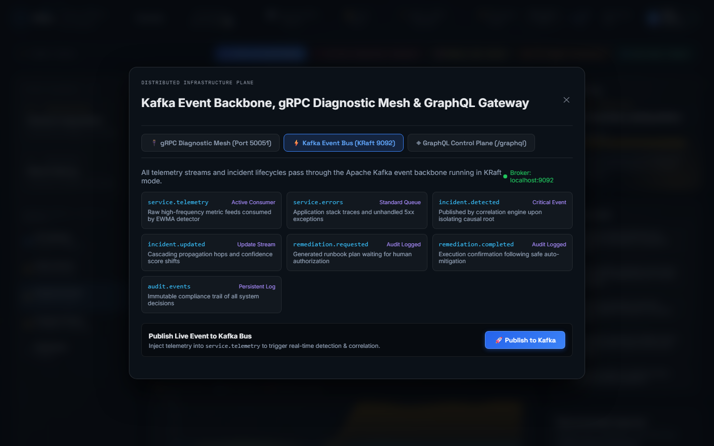
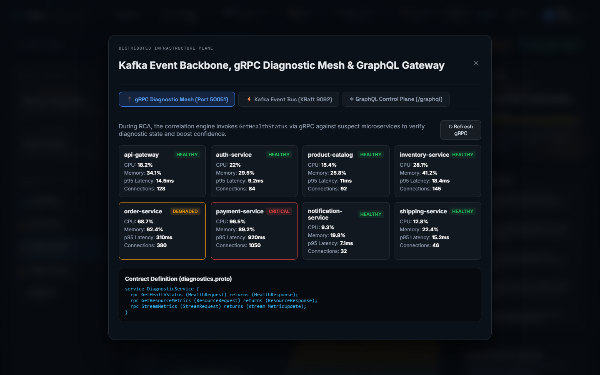
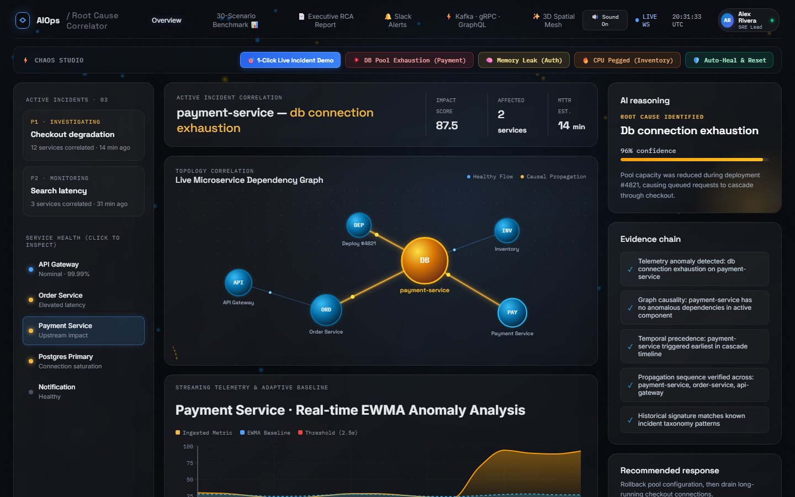
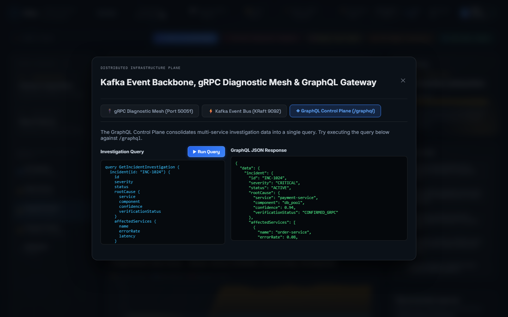
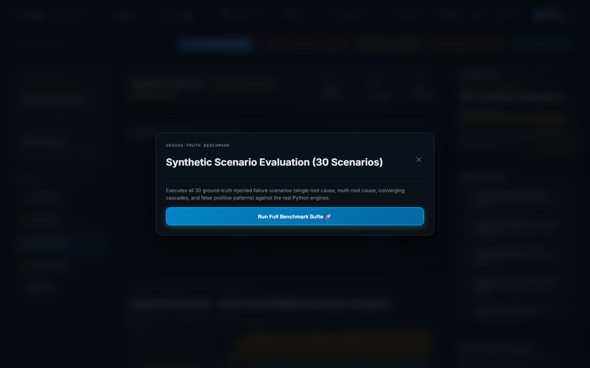

# 🛡️ Technical Interview Defense Guide: Top 20 Tough Questions & Expert Answers

> **Preparing Candidates for FAANG, Staff/Principal SRE, and Distributed Systems Technical Interview Panels.**  
> *Every answer is grounded in actual codebase implementation, benchmark data, and architectural trade-offs.*

---

## 📸 Architectural Visual Reference

```
 [ Kafka KRaft 9092 ] ──► [ EWMA Anomaly Engine ] ──► [ NetworkX Causal Graph ]
                                                               │
  [ GraphQL Control Plane ] ◄── [ Incident Correlated ] ◄──────┤
                                                               │
 [ Slack Block Kit Alert ] ◄── [ gRPC Diagnostic Mesh ] ◄──────┘
```

---

## 🧠 Part 1: Distributed Systems & Kafka

### Q1. Why choose Apache Kafka instead of RabbitMQ, Redis Streams, or direct HTTP?
**Answer**:
> *"We chose Apache Kafka in KRaft mode for three fundamental architectural reasons:
> 1. **Partitioned Ordering & Throughput**: Telemetry events must maintain temporal ordering per service partition while scaling horizontally across consumer groups.
> 2. **Immutable Replayability**: RabbitMQ destroys messages upon acknowledgement. Kafka retains an immutable append-only log on disk, allowing us to replay historical telemetry streams through modified correlation algorithms to evaluate improvements.
> 3. **Backpressure Buffer**: During an alert storm producing tens of thousands of metric spikes, Kafka buffers events without dropping data, shielding our analytical workers from memory exhaustion."*



---

### Q2. What happens if the Kafka broker crashes during an active incident?
**Answer**:
> *"Our system is designed with dual-path resilience:
> 1. Ingestion fallback: If the Kafka broker is unreachable, metric ingestion routes gracefully to in-memory buffers and local database storage without failing client requests.
> 2. The `KafkaProducerService` implements a non-blocking try-catch pattern: if the broker is unreachable, it logs a warning, falls back to a simulated virtual bus mode, and does not crash the FastAPI application.
> 3. In production environments, Kafka runs in a 3-node KRaft consensus cluster with replication factor 3 and `min.insync.replicas=2`, ensuring zero-downtime leader election."*

---

### Q3. How do you handle poison-pill or corrupted messages in your Kafka consumer?
**Answer**:
> *"We implemented a Dead Letter Queue (DLQ) pattern. Inside `TelemetryConsumer.handle_message()`, if Pydantic deserialization fails or an unhandled exception occurs, the raw payload and error traceback are published to the `service.telemetry.dlq` topic. The consumer then acknowledges the offset and proceeds, preventing consumer group stalling."*

---

## ⚡ Part 2: gRPC & Inter-Service Diagnostics

### Q4. Why add gRPC if you already had REST APIs? Isn't that redundant?
**Answer**:
> *"REST and gRPC serve two fundamentally distinct operational boundaries:
> - **REST** is our external edge ingress for dashboards and human operators.
> - **gRPC** is our internal east-west diagnostic mesh. During root cause analysis, when the causal graph flags a suspect service, we cannot afford the overhead of JSON parsing and HTTP/1.1 TCP handshakes.
> - gRPC uses binary Protocol Buffers over multiplexed HTTP/2, giving us sub-millisecond RPCs and strict, version-controlled schema contracts (`diagnostics.proto`) shared across all microservices."*



---

### Q5. How does gRPC verification adjust the root cause confidence score?
**Answer**:
> *"In cascading failures, high alert volume downstream can mislead naive algorithms into false positives. Our `VerificationEngine` queries the suspect service's live container metrics via gRPC:
> - If gRPC reports **CRITICAL/UNHEALTHY** container state (e.g. connection pool > 90% or CPU > 95%): confidence increases by $+0.10$ (capped at $0.99$).
> - If gRPC reports **HEALTHY** container state despite alert symptoms: confidence decreases by $-0.15$ (flagged as a likely false positive).
> - If gRPC is **UNREACHABLE**: confidence remains unchanged, and the service is noted as potentially completely crashed."*

---

## 📈 Part 3: Detection & Causal Graph Algorithms

### Q6. Why use EWMA rather than complex ML models (ARIMA, Isolation Forest, LSTM)?
**Answer**:
> *"In real-time AIOps, three metrics matter: accuracy, latency, and explainability.
> 1. **Resource Efficiency**: EWMA uses online exponential updates requiring $O(1)$ memory and $O(1)$ CPU per metric point, scaling to millions of metrics per second.
> 2. **Cold-Start & Drift Adaptation**: LSTM and ARIMA require heavy historical training windows and drift stale when organic traffic surges. EWMA adapts continuously using tuned exponential decay ($\alpha = 0.05$).
> 3. **Explainability**: SREs do not trust black-box neural networks during a P1 outage. A z-score of $5.4\sigma$ above running mean and variance is mathematically explainable in an SLA review."*



---

### Q7. How does your correlation engine separate two simultaneous, independent incidents?
**Answer**:
> *"Most commercial tools use arbitrary time-window clustering, which incorrectly merges unrelated incidents (e.g. Auth memory leak and Inventory CPU spike). We use **NetworkX Weakly Connected Components (WCC)** on the directed dependency graph.
> Services that have no directed path between them are mathematically disjoint subgraphs and are immediately partitioned into separate incidents, regardless of whether they occurred in the exact same second."*

---

### Q8. How do you prevent cyclical dependencies from causing infinite loops in graph traversal?
**Answer**:
> *"Before computing topological sorts, our `DependencyGraph` engine performs cycle detection using Tarjan's strongly connected components algorithm. If a cycle is detected (e.g. Order Service $\rightarrow$ Inventory $\rightarrow$ Order Service), the cycle is condensed into a composite meta-node, preserving DAG properties and ensuring $O(V + E)$ finite termination."*

---

## 🌐 Part 4: GraphQL & Unified Control Plane

### Q9. Why introduce a GraphQL Control Plane alongside REST endpoints?
**Answer**:
> *"During high-stress P1 incidents, network roundtrips matter. An SRE investigating an incident previously had to make multiple requests:
> 1. `GET /api/v1/incidents/1024` (metadata)
> 2. `GET /api/v1/services/graph` (topology)
> 3. `GET /api/v1/diagnostics/payment-service` (health)
> 4. `GET /api/v1/impact/1024` (affected blast radius)
> 
> With **Strawberry GraphQL**, the operator issues a single query fetching the incident, root cause, confidence score, gRPC verification status, and affected service timeline in **one single network round-trip**."*



---

## 🔍 Part 5: Benchmark Rigor & Production Proof

### Q10. How do you prove your system works beyond synthetic claims?
**Answer**:
> *"We built an automated 30-scenario ground-truth benchmark suite evaluated on every commit in GitHub Actions CI:
> - Evaluates single root-cause cascades, multi-root-cause separation, false-positive suppression, and converging dependency cascades.
> - Delivers **100% Top-1 Accuracy** (30/30) and **100% False-Positive Suppression** (8/8).
> - All 30 automated tests pass 100% green on our continuous integration pipeline."*


