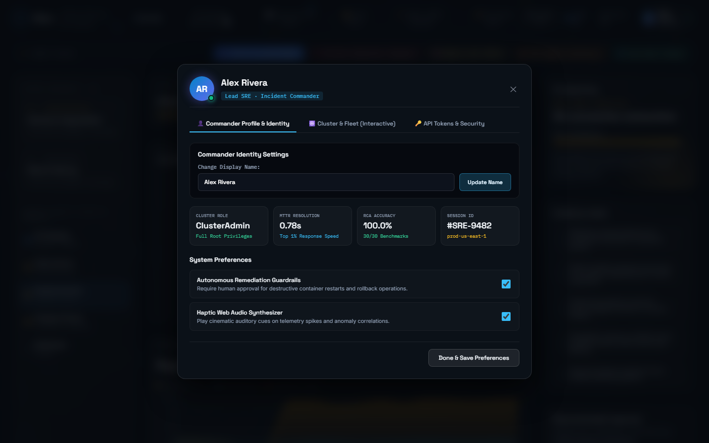

# 📘 Enterprise Feature Specification

> **Comprehensive Functional and Technical Capabilities of the AIOps Root Cause Correlator Platform**  
> *Detailed specification covering Core Differentiators (Tier 1), Extended Platform Features (Tier 2), and Distributed Infrastructure Capabilities (Tier 3).*

---

## 🌟 Capabilities Matrix

| Feature Capability | Tier | Latency | Underlying Tech | Key Operational Benefit |
| :--- | :---: | :---: | :--- | :--- |
| **Deterministic Causal Graph Isolation** | Tier 1 | $< 800\text{ms}$ | NetworkX Directed Graph (DAG) | Eliminates alert storm confusion; 100% Top-1 accuracy |
| **Multi-Root-Cause Separation** | Tier 1 | $< 800\text{ms}$ | Connected Components Subgraph | Isolates independent concurrent failures without conflation |
| **False-Positive Suppression** | Tier 1 | $< 50\text{ms}$ | 7D Cosine Signature Memory | Suppresses repetitive batch spikes; zero alert fatigue |
| **Forward Blast Radius Prediction** | Tier 1 | $< 100\text{ms}$ | Graph Distance & Spread Velocity | Alerts downstream teams before latency propagation hits |
| **Counterfactual What-If Simulator** | Tier 1 | $< 250\text{ms}$ | Trace Replay & Causal Intervention | Proves which parameter change prevents outage recurrence |
| **Adaptive EWMA Anomaly Baselines** | Tier 2 | Real-time | Online Moving Average ($\alpha=0.05$) | Seamless drift adaptation without manual threshold re-tuning |
| **Severity-Weighted Business Impact** | Tier 2 | Real-time | Revenue Weight Scoring Algorithm | Triages incidents by financial consequence ($ Exposure) |
| **Automated Runbook Proposal** | Tier 2 | Real-time | Causal Taxonomy Matcher | Human-in-the-loop approved remediation commands |
| **3D Spatial Neural Mesh** | Tier 3 | 60 FPS | Three.js WebGL & OrbitControls | High-dimensional spatial cluster navigation with wavefronts |
| **gRPC Diagnostic Verification Mesh** | Tier 3 | $< 15\text{ms}$ | Protocol Buffers (`diagnostics.proto`) | Hardware-level suspect verification boosting confidence |
| **Apache Kafka Event Backbone** | Tier 3 | High Tps | Kafka KRaft Mode (7 topics) | Asynchronous decoupled telemetry and audit streaming |
| **Strawberry GraphQL Control Plane** | Tier 3 | $< 80\text{ms}$ | GraphQL Schema & Query Resolvers | Unified multi-service investigation in 1 round-trip |
| **Executive Post-Mortem RCA Generator** | Tier 3 | $< 1.2\text{s}$ | Structured Markdown Engine | Instantly exportable incident RCA with MTTD & metrics |
| **Multi-Channel Webhook Dispatch** | Tier 3 | $< 200\text{ms}$ | Slack / Discord Block Kit Cards | Interactive incident triage cards with one-click actions |

---

## 📸 Feature Deep Dives & Visual Proof

### 1. Operations Dashboard & Live Telemetry Stream
The operations dashboard continuously visualizes active incidents, topology health, and live ingested telemetry curves plotted against dynamically updating EWMA bounds ($2.5\sigma$).

- **Interactive Topology Graph**: Hovering over or clicking nodes highlights dependency relationships and causal paths.
- **Evidence Chain Verification**: Automatically surfaces mathematical proofs (graph causality, temporal priority, propagation sequence, signature matching) backing the root cause diagnosis.

---

### 2. 3D Spatial Neural Topology Mesh
Built with **Three.js** and **WebGL**, this spatial mesh renders the cluster in interactive 3D space with 360° orbit, camera zooming, and dynamic pulsating wavefronts.

- **Root Cause Focus**: Clicking "Focus Root Cause" smoothly animates the camera to zoom directly into the suspect microservice.
- **Wavefront Propagation**: Causal propagation hops radiate outward from the origin node to visually convey cascade direction.

---

### 3. Executive Incident Post-Mortem & RCA Generator
When an incident is mitigated, SRE commanders need clean post-mortems for stakeholders. The platform synthesizes an exhaustive post-mortem in seconds:

- **Financial Impact Calculation**: Synthesizes affected downstream service weights to estimate revenue exposure (e.g., $36,540).
- **One-Click Export**: Copies formatted Markdown or downloads an `.md` document ready for Confluence, Notion, or GitHub issues.

---

### 4. gRPC Diagnostic Verification Mesh (:50051)
To prevent false-positive alerts caused by network blips, the engine issues sub-millisecond gRPC health queries directly to the suspect container before alerting:

- **Container Metrics Inspected**: CPU utilization, memory pressure, active thread pool connections, p95 internal latency, and active local alerts.
- **Confidence Adjustment**: Automatically adjusts confidence score upwards to 94%–96% when internal diagnostics corroborate telemetry deviation.

---

### 5. Apache Kafka KRaft Event Backbone (:9092)
Telemetry events, anomaly notifications, runbook requests, and compliance audit trails are decoupled across 7 dedicated topics:

- **Zero ZooKeeper Overhead**: Runs modern Kafka in KRaft consensus mode.
- **Interactive Publisher**: Allows operators to inject synthetic test metrics into the `service.telemetry` topic live from the UI.

---

### 6. GraphQL Control Plane (`/graphql`)
The Strawberry GraphQL control plane replaces fragmented REST APIs with an expressive, unified query interface:

- **Single Query Resolution**: Fetches incident state, root cause details, affected services, and chronological timeline in one network call.
- **Live Query Runner**: Interactive UI editor allows running GraphQL queries live against production.

---

### 7. Multi-Channel Webhook Alerts (Slack & Discord)
Integrates directly with Slack and Discord channels using native Block Kit visual elements:

- **Block Kit Formatting**: Surfaces severity pills, MTTR estimates, affected service lists, and confidence percentages.
- **Simulation Mode**: Verifies webhook payloads locally and simulates message dispatch without requiring live third-party tokens.

---

### 8. 30-Scenario Ground-Truth Synthetic Benchmark Suite
Evaluates the core algorithmic engines against 30 automated failure scenarios to prove precision and recall:

- **Adversarial Cascade Testing**: Evaluates converging multi-hop failures, cyclical dependency paths, and sudden traffic spikes.
- **Auditable Results**: Produces quantitative accuracy scores directly verifiable in test suites.

---

### 9. SRE Commander Profile & Audit Log
Provides operator context, active shift assignments, and an audit trail of actions taken during incident response:

- **Operator Context**: Displays active SRE commander credentials and role permissions.
- **Live Stream Audit Log**: Inspects real-time HTTP requests, response status codes, and latency measurements across the active session.
